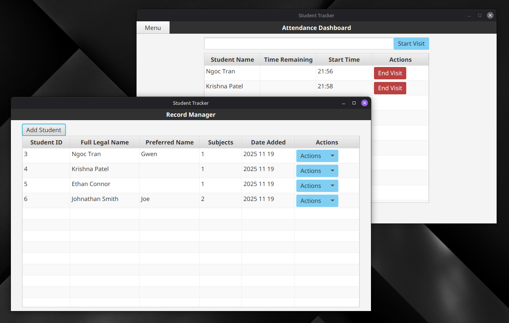

# 📚 Student Tracker

[](https://github.com/unchangingConstant/student-tracker/actions)
[](https://codecov.io/gh/unchangingConstant/student-tracker)

## 🎯 Overview
A desktop attendance management system built for Kumon learning centers to replace unreliable cloud-based solutions. This application eliminates latency issues and internet dependency while providing front-desk staff with an intuitive interface for managing student check-ins during high-traffic hours.

**The Problem:** A local Kumon center owner struggled with existing software plagued by poor performance, unnecessary cloud dependencies, and a confusing UI that hindered daily operations.

**The Solution:** A lightweight, offline-first desktop application featuring real-time dashboards, QR code integration, and instant data exports—purpose-built for the fast-paced environment of educational centers.



## ✨ Key Features
- 📊 **Live Attendance Dashboard** – Real-time display of student time remaining at the center
- 📱 **QR Code Integration** – Seamless attendance logging via external scanner
- 🗂️ **Intuitive Record Manager** – GUI-based database editor for effortless data management
- 📤 **Excel Export** – One-click attendance record exports for reporting

## 🛠️ Technical Stack
- **Build & Package** – Maven 3.9.10
- **Frontend** – JavaFX 21
- **Database** – JDBI 3 + SQLite
- **Dependency Injection** – Google Guice
- **Testing** – JUnit 5, Mockito, Instancio
- **Deployment** – Panteleyev JPackage Maven Plugin

## 💻 Development Setup

### Prerequisites
- Maven 3.9.11
- Java 21
- SQLite3 CLI (optional, for database inspection)

### Quick Start
```bash
# Clone the repository
git clone https://github.com/unchangingConstant/student-tracker.git

# Build and run
mvn clean javafx:run
```

### Deployment
This application is packaged as a non-modular executable with all dependencies bundled into the classpath for maximum compatibility.
```bash
# Generate native executable
mvn clean verify jpackage:jpackage
```

**Output:** `target/distribution/StudentTrackerApp/`
- **Windows:** Run `StudentTrackerApp.exe`
- **Linux:** Run `bin/StudentTrackerApp`

> **Note:** Currently generates portable applications without installers.

## 📝 License
Unlicensed (All rights reserved)

---

**Author:** [@unchangingConstant](https://github.com/unchangingConstant)
