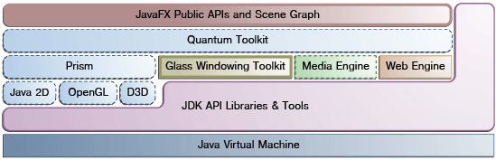

# JavaFX

## JavaFX Architecture

The JavaFX API is built off of many pre-existing libraries detailed in the image below.

We will go over the role each component plays in JavaFX.

### Scene Graph

The JavaFX scene graph is the starting point for constructing a JavaFX app. The scene graph is a hierarchical tree of nodes that represents all visual elements of the application's UI. It can handle input and be rendered.

Each node of a graph has an ID, styleClass, and bounding volume except for the root node. Each has exactly one parent except for the root node.

### The Graphics

All components colored in blue drives the JFX graphics system.

**Prism** processes render jobs. It accesses whatever graphics engine the current machine has it its disposal to render graphics like DirectX, OpenGL, etc. When hardware accelerated graphics aren't possible, it performs software renderings.

**Quantum Toolkit** ties Prism and Glass Windowing Toolkit togther and makes them available to JavaFX above.

### Threads

TODO
